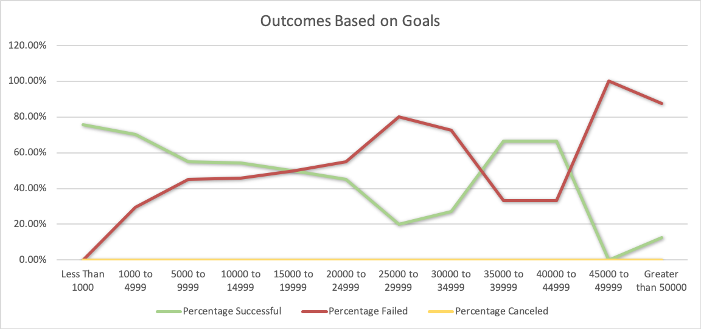
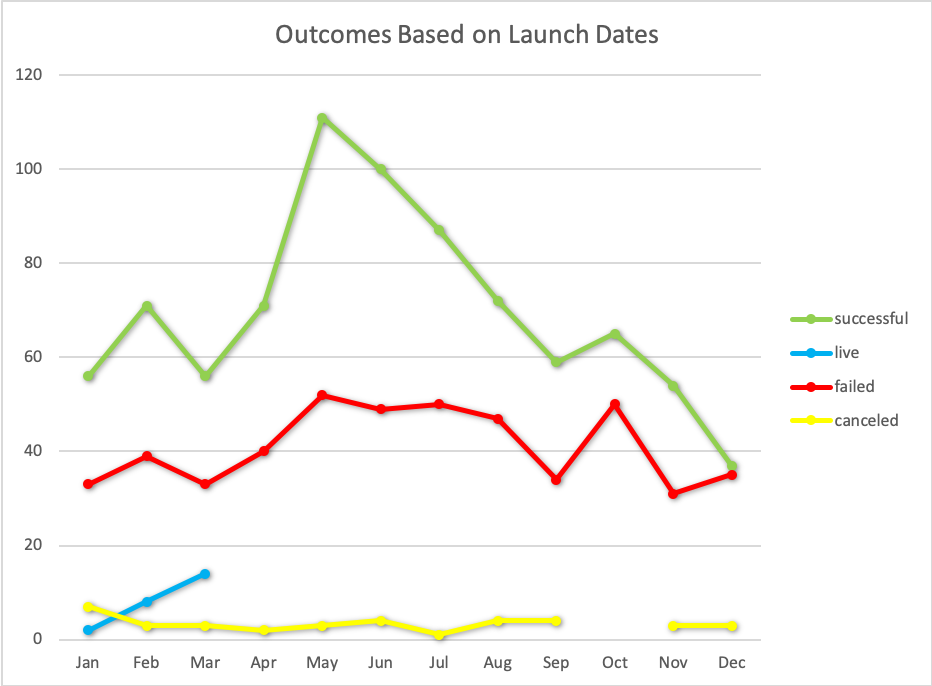

# An Analysis of Kickstarter Campaigns
Performing analysis on Kickstarter data to uncover trends

### Challenge
#### Outcomes Based on Goals

#### Outcomes Based on Launch Dates

Analysis: 
- Play campaigns that had a %50 or higher successful outcome had goals of less than $14999 and between $35000 to $44999
- Play campaigns that had a %50 or higher failed outcome had goals of $15000 to $34999 and $45000 or greater.
- From our launch data analysis we can conclude that there is a trend of most successful outcomes for theater campaigns occurr when launched in the months of May or June.

